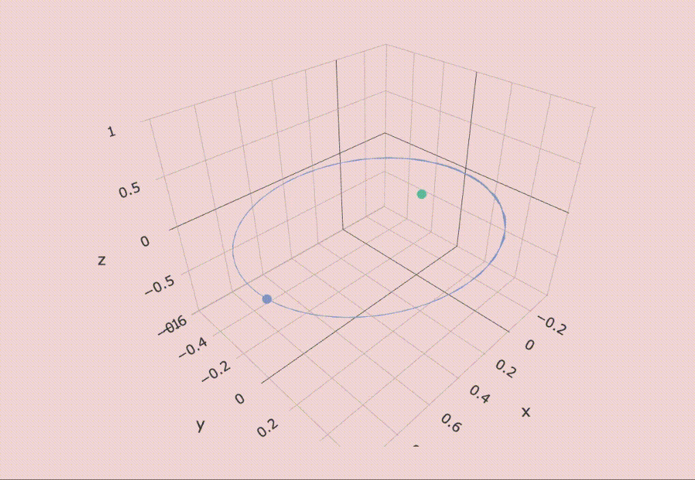

## numerical integration and validation

```{r, echo=FALSE, warning=FALSE, message=FALSE}
alldata = read.csv("./data/posdata_kepler_N_2_G_1_t0_0_tf_20_dt_0.01.csv") %>%
  select(-X)
 
N = 2
G = 1
t0 = 0
tf = 20
dt = 0.01
TN = (tf-t0)/dt
m1 = 0.999
m2 = 0.001
```

```{r, echo=F, warning=FALSE, message=FALSE}
x_alldata = alldata[ ,1:N]
y_alldata = alldata[ ,(N+1):(2*N)]
z_alldata = alldata[ ,(2*N+1):(3*N)]

x_alldata = x_alldata %>%
  gather(coord,x)
y_alldata = y_alldata %>%
  gather(coord,y) 
z_alldata = z_alldata %>%
  gather(coord,z) 

bodylabels = NULL
for (i in 1:N) {
  bodylabels[i] = paste("m",i,sep = "")
}

bodylabels_list = NULL

for (i in 1:N) {
  bodylabels_list = append(bodylabels_list, rep(bodylabels[i],TN))
}

## vertical data
vertdata = data.frame(x = x_alldata$x, 
			  y = y_alldata$y, 
			  z = z_alldata$z, 
			  body = bodylabels_list,
			  t = c(rep(alldata$t,N)))
```

```{r, echo=F, warning=F}
# ggplot(data = alldata, aes(x = x2, y = y2)) + 
#   geom_point(size = 0.01) +
#   geom_point(aes(x = x1, y = y1), size = 0.01) +
#   theme_light()
```

\ 

\ 

\ 

## runge-kutta integration 

`RK and Hermite integrators coming soon`

\ 

\ 

\ 

## integration error 

Verlet integration is a second order method so  its error is in the third order of  the step size. We can find the overall error by computing the analytic position at each time step and comparing to the estimated position. The analytic position is given:

$$r(\phi) = \frac{a(1-\epsilon^2)}{1+\epsilon\cos\phi}$$

where $a$ is the semimajor and $\epsilon$ is the eccentricity,  $\epsilon = \frac ca$ where $c$ is the semiminor.  

Here is some code to compute the angle $\phi$ and the theoretical distance from the orbit barycenter.  


```{r}
df = df %>%
  mutate(phi = 0)

for (i in 1:TN) {
  a = matrix(c(df$x2[i], df$y2[i]), nrow = 2)
  b = matrix(c(aphelion, 0), nrow = 2)
  phi = acos( sum(a*b) / ( sqrt(sum(a * a)) * sqrt(sum(b * b)) ) )
  df$phi[i] = phi
}

## find semimajor and semiminor
tauindex = 3.38/dt
majorA = min(df$x2[1:tauindex+10])
majorB = max(df$x2[1:tauindex+10])
semimajor = (majorB - majorA)/2

minorA = min(df$y2[1:tauindex+10])
minorB = max(df$y2[1:tauindex+10])
semiminor = (minorB  - minorA)/2

c = sqrt(semimajor^2 - semiminor^2)

eccentricity = c/semimajor


df = df %>%
  mutate(r2CoM_true = (semimajor*(1-eccentricity^2))/(1+eccentricity*cos(phi)))
```

```{r}
ggplot(data =  df,  aes(x = t, y = r2CoM_true)) + geom_point()
```

\ 

\ 

\ 

## revised intro

The motion of celestial systems is governed by Newton's law of universal gravitation...:

The geometry of planetary orbits was first described accurately by Kepler, with his three laws of planetary motion: 

```{r, echo=F, fig.margin=T} 

```

- planets move in elliptical orbits with the Sun at one of the two foci
- a line segment joining the planet to the Sun sweeps out area at a constant rate 
- a planet's orbital period $\tau$ is related to the semimajor axis of orbit $a$ by the relation $\tau^2 = a^3$

These laws are purely empirical, not physical, and describe a geometric model based on Kepler's observations of planets orbiting the Sun.  

The modern analytic approach was devised by Newton with the laws of motion and the law of universal gravitation. Newton's laws generally agreed with Kepler's description of planetary orbits, with the caveat that Newton's third law requires the gravitational pull of the planet to also cause the Sun to move. In reality the Sun is so much larger than the planet that its motion is effectively negligible. 

One of Newton's triumphs was discovering that gravitational attraction is a conservative force, meaning $n$-body planetary systems can be modelled as point particles with all their mass concentrated at the centre.  

Newton's laws allowed the two-body problem to be solved completely. But they were ineffective at producing solutions for more complex systems due to their chaotic nature; only the two-body problem was stable enough for a completely generalisable solution. Most attempts to describe the motion of systems with three or more bodies have resulted in specific solutions for certain conditions, but no fully generalisable solution has been discovered. 

\ 

\ 

\ 

## the equation of orbit

Since the motion is orbital, it's useful to switch to 2D polar coordinates ($r, \phi$). In terms of polar coordinates the Lagrangian is:

$$\mathcal L = \frac 12 \mu (\dot r^2 + r^2 \dot\phi^2) - U(r)$$

then:

- phi equation: phi ignorable, angular momentum constant
- radial equation: solve

equivalent 1D problem of particle in effective potential. 

energy considerations: bounded vs unbounded orbits  

the equation of orbit: get $r(\phi)$ by doing some wrangling. get equation of ellipse in polar coordinates. Transform to cartesian coordinates.   

picture of ellipse. equivalent two body problem: scaled down versions of the one-body ellipse, with the smae eccentricity. both ellipses share a common focus.  

applications: the one-body equivalence can approximate the two-body system if one mass is much heavier than the other. e.g. a planet orbiting the sun: effectively a one body problem.  

This analytic approach works for the two-body problem because of its stability (all orbits are elliptical, parabolic, or hyperbolic). But the approach does not generalise to systems where $n \geq 3$, as the motion is unstable. $\clubsuit$. 


